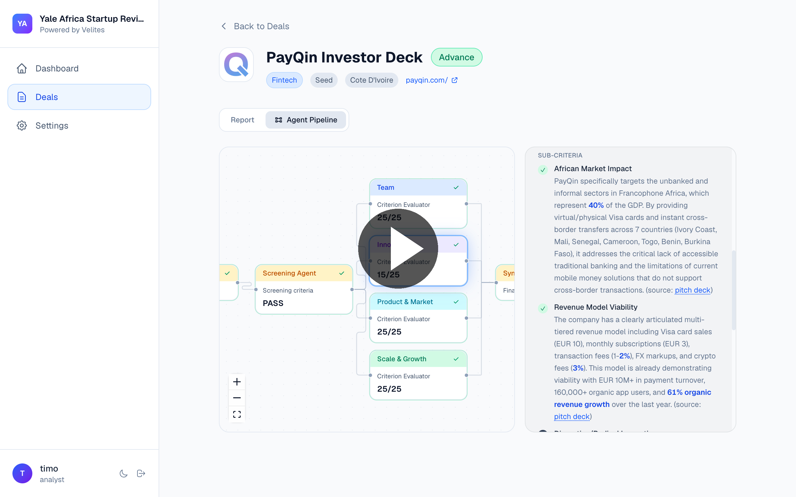
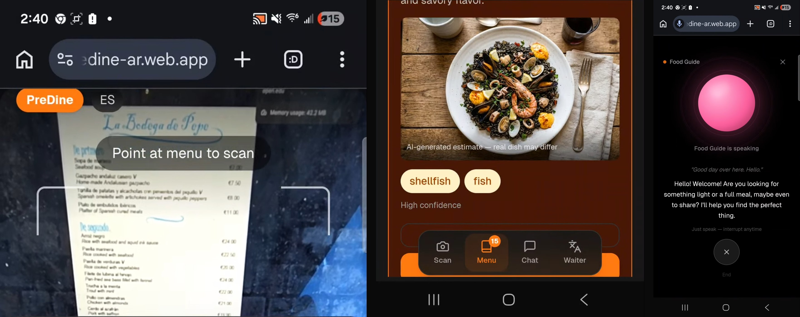
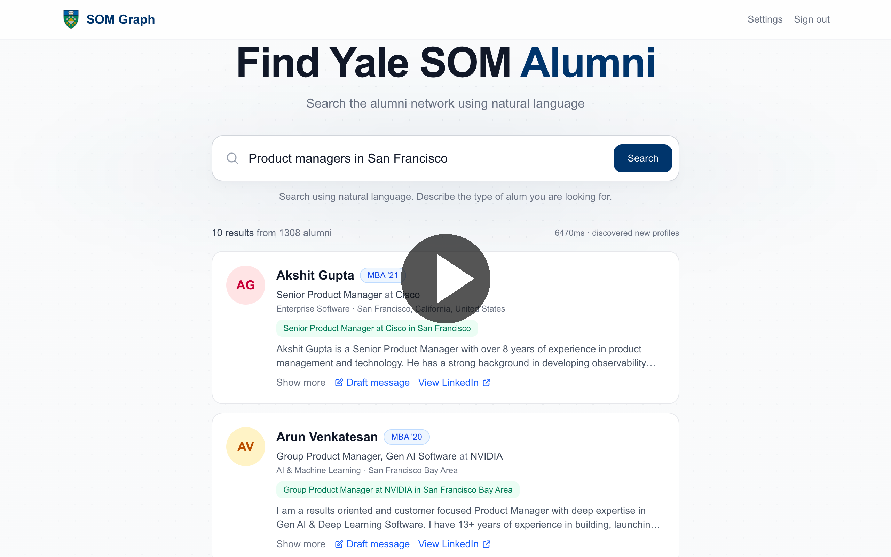

# Hey, I'm Timo 👋

Ex-founder/engineer/VC -> Back to Building 

I build 0→1 products in high-ambiguity environments.

My journey is unique: I've led a global fintech venture lab inside a $600M organization, built products at a YC-backed fintech that raised a $40M Series A, founded and scaled a startup to 1,500 SMB customers across 7 countries, and deployed $2M+ into early-stage companies.

That range shapes how I think about product building. I'm drawn to frontier problems, new markets, and unwritten playbooks. I operate comfortably across technical architecture, product strategy, and go-to-market.

📝 I occasionally write about the ideas I’m thinking through → [seeingaroundcorners.substack.com](https://seeingaroundcorners.substack.com)  
🤝 Always happy to connect with others building in applied AI, fintech and frontier spaces.

---

## 🛠️ Recent Things I've Built (Vibe-Coding)

### [Velites](https://velites.ai/)
AI deal intelligence for VC funds. Multi-agent pipeline that screens and scores pitch 
decks against a fund's custom thesis — delivering explainable evaluations in minutes 
instead of hours. Built at Yale; piloted with real investor teams. Semi-finalist at 
the [Columbia Business School AI Startup Challenge](https://business.columbia.edu/ai-startup-challenge).

`Multi-Agent` `Document AI` `Structured Output` `VC`  
🎥 [Demo](https://velites.ai/velites-demo.mp4)

---

### [PreDine AR](https://predine-ar.web.app/)
AI-powered menu translator and dish visualizer for travelers. Scan any foreign menu, 
get instant dish explanations with allergen info, generate AI images of dishes, preview 
them on your table in AR, and communicate dietary needs to waiters in the local language. 
Won 3rd place at the [Google x Yale Build with AI Hackathon](https://gdg.community.dev/events/details/google-gdg-nyc-presents-yale-build-with-ai-hackathon-x-google-cloud-labs-day-i/).

`Vision-Language` `Image Generation` `Voice AI` `Real-Time`  
🎥 [Demo](https://drive.google.com/file/d/1ksKNq5GDdJJcNnGfM-4NDOOfHXJetVGf/view?usp=drive_link)

---

### [IB Interview Gym](https://ib-interview-gym.vercel.app/)
AI-powered prep platform for investment banking interviews. Combines adaptive 
flashcards with VP-style mock interviews, real-time feedback, and scorecards — so 
candidates walk into Superdays sounding polished and confident.  
`Voice AI` `Real-Time` `LLM Evaluation` `EdTech`  
🎥 [Demo](#)

---

### [Yale SOM Graph](https://www.somgraph.com/)
Semantic search and conversational outreach over the Yale SOM alumni network. 
Describe who you're looking for in plain English ("people who pivoted from finance 
to product") and SOM Graph retrieves grounded profiles, then drafts a LinkedIn 
message tailored to both their career and yours. Refine it in chat until it sounds 
like you. Built on a RAG pipeline over 1,300+ profiles.

`Agentic RAG` `Semantic Search` `Chat Agents` `Productivity`  
🎥 [Demo](https://somgraph.com/demo.mp4)

---

### [LaunchLens](https://launch-lens-two.vercel.app)
AI research workflow for marketing and product teams. Feed it an audience and a 
question — it scrapes the voice of the customer, clusters it into structured insights, 
runs probing AI customer interviews, and synthesizes campaign-ready positioning and 
messaging.  
`Multi-Agent` `Web Scraping` `Clustering` `Marketing`  
🎥 [Demo](#)

---

## 📬 Let's Connect
- LinkedIn: [linkedin.com/in/timothyasiimwe](https://linkedin.com/in/timothyasiimwe)
- Substack: [seeingaroundcorners.substack.com](https://seeingaroundcorners.substack.com)
- Blog: [timothyasiimwe.com](https://timothyasiimwe.com)
